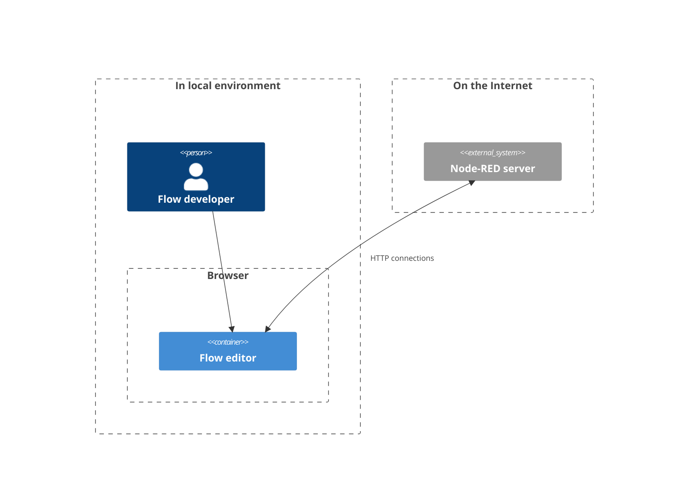
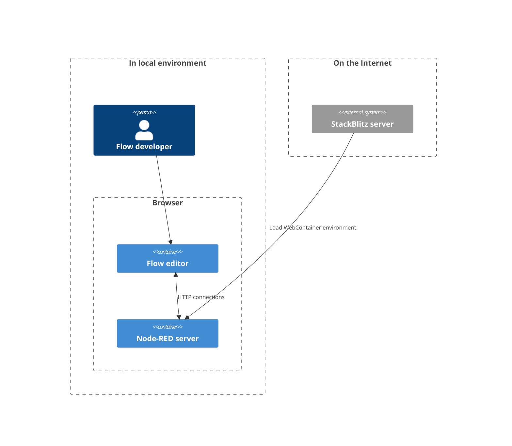

# Node-RED for WebContainer
This repository provides a WebContainer template to execute Node-RED on your web browser only.
You can access the flow editor from the following URL.

**Node-RED flow editor**

https://stackblitz.com/github/kazuhitoyokoi/node-red-webcontainer?embed=1&hideExplorer=1&hideNavigation=1&view=preview

## How does it work?
### General architecture of Node-RED
 In general, flow developers use a flow editor on their browser but the background process of Node-RED runs on the local server or remote server.
To set up the Node-RED environment on your PC or IaaS, you need to install Node.js in advance and operate the `npm install` command on the command prompt or terminal. 
If the Node-RED service is available on the Internet, you also need stable network connections and a server which can work in twenty-four seven.
The following diagram shows the general architecture of Node-RED.

### WebContainer architecture for Node-RED
 On the other hand, Node-RED on WebContainer executes both the flow editor process and server process on your browser as following diagram.
Therefore, once loading the flow editor with WebContainer, you can use the flow editor while the page is opened.

 This environment is beneficial to try flow editor temporarily.
In addition to this merit, it can provide a frontend UI developed by Node-RED.

# Demonstrations
 The followings are the frontend examples to show data on the dashboard or world map UI.
- [React Node-RED dashboard](https://stackblitz.com/github/kazuhitoyokoi/node-red-webcontainer?embed=1&hideExplorer=1&hideNavigation=1&view=preview&initialpath=uikit)
- [World map to track ISS](https://stackblitz.com/github/kazuhitoyokoi/node-red-webcontainer?embed=1&hideExplorer=1&hideNavigation=1&view=preview&initialpath=worldmap)

# Known issues
Due to the restriction of the WebContainer, there are some issues in this environment.

- Firefox doesn't work for this environment. Google Chrome, Microsoft Edge, Safari including mobile browsers are supported for this environment. 
- The user cannot install additional nodes to the palette.
- `http request` node cannot access HTTP endpoints without the CORS header.
- `mqtt-in` and "mqtt-out` nodes don't work correctly.
